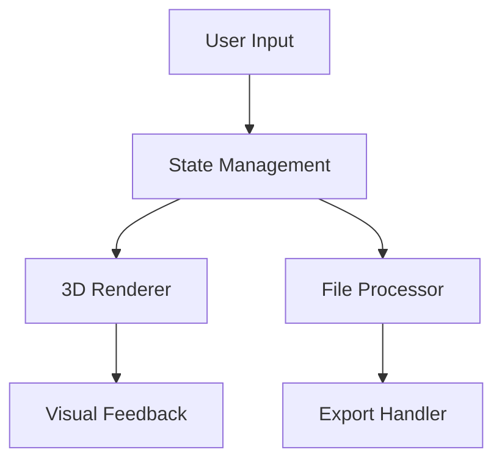

# Interactive STL Viewer

A modern web application for viewing, analyzing, and manipulating STL files with advanced features like point selection, shape matching, and export capabilities.

## Table of Contents
- [Overview](#overview)
- [Architecture](#architecture)
- [Key Features](#key-features)
- [Technical Stack](#technical-stack)
- [Component Structure](#component-structure)
- [State Management](#state-management)
- [File Operations](#file-operations)
- [3D Rendering](#3d-rendering)
- [Mobile Support](#mobile-support)
- [API Reference](#api-reference)
- [Performance Optimization](#performance-optimization)
- [Security Considerations](#security-considerations)
- [Maintenance Guidelines](#maintenance-guidelines)
- [Development Workflow](#development-workflow)
- [Troubleshooting Guide](#troubleshooting-guide)

## Overview

The Interactive STL Viewer is a Next.js-based web application that provides a powerful interface for working with STL files. It supports various operations including:
- 3D model viewing and manipulation
- Point selection and annotation
- Shape matching and comparison
- Multiple export formats (STL, OBJ, PLY)
- Responsive design for desktop and mobile devices

### Key Benefits
- Real-time 3D visualization
- Intuitive user interface
- Cross-platform compatibility
- High-performance rendering
- Advanced file processing capabilities

## Architecture

The application follows a modern React architecture with the following key aspects:

### Frontend Architecture
- Next.js 13+ with App Router
- Client-side rendering for 3D operations
- Component-based architecture
- Responsive design patterns
- Local storage for persistence

### Data Flow


### Directory Structure
```
├── app/                 # Next.js app directory
├── components/          # React components
│   ├── ui/             # UI components
│   └── 3d/             # 3D-specific components
├── lib/                # Utility functions
├── hooks/              # Custom React hooks
├── styles/             # Global styles
└── public/             # Static assets
```

## Key Features

### 1. STL File Handling
- Drag-and-drop file upload
- Progress tracking during file loading
- Error handling and validation
- Support for large file sizes
- File format validation
- Automatic file type detection
- Chunked file processing

### 2. 3D Viewing
- Interactive camera controls
- Zoom, pan, and rotate operations
- Grid and axes visualization
- Quality settings for different devices
- Custom lighting setup
- Environment mapping
- Shadow rendering
- Anti-aliasing support

### 3. Point Selection
- Click-to-select points on the model
- Point type specification
- Point management (add, remove, clear)
- Auto-save functionality
- Point grouping
- Point measurement
- Point annotation
- Point export

### 4. Shape Matching
- Real-time shape comparison
- Confidence scoring
- Visual feedback for matches
- Multiple matching algorithms
- Custom matching parameters
- Match visualization
- Match export
- Match history

### 5. Export Capabilities
- Multiple format support (STL, OBJ, PLY)
- Quality settings
- Compression options
- Metadata inclusion
- Batch export
- Custom export templates
- Export progress tracking
- Export validation

## Technical Stack

### Frontend
- **Framework**: Next.js 13+
- **Language**: TypeScript
- **Styling**: Tailwind CSS
- **State Management**: React Hooks
- **Build Tools**: 
  - TypeScript
  - PostCSS
  - Tailwind
  - ESLint
  - Prettier

### 3D Rendering
- **Engine**: Three.js
- **React Integration**: React Three Fiber
- **Helpers**: @react-three/drei
- **Physics**: Custom implementation
- **Optimization**: Custom shaders

### File Processing
- **STL Parser**: Custom implementation
- **OBJ Parser**: Custom implementation
- **PLY Parser**: Custom implementation
- **Compression**: Custom algorithms

## Component Structure

### Core Components
- `STLViewer`: Main 3D viewer component
  - Handles 3D scene setup
  - Manages camera controls
  - Processes user interactions
  - Coordinates with other components

- `Sidebar`: Control panel and settings
  - Displays point list
  - Shows measurement tools
  - Provides export options
  - Manages settings

- `Header`: Application header with actions
  - File operations
  - View controls
  - Settings access
  - Help resources

- `MobileBottomSheet`: Mobile-specific controls
  - Touch-optimized interface
  - Quick actions
  - Context menus
  - Gesture controls

### 3D Components
- `STLModel`: STL file rendering
  - Geometry processing
  - Material setup
  - Event handling
  - Performance optimization

- `CylinderMockups`: Cylinder visualization
  - Custom geometry
  - Material properties
  - Animation support
  - Interaction handling

- `MatchedShapes`: Shape matching visualization
  - Match rendering
  - Confidence display
  - Selection handling
  - Animation effects

- `CameraControls`: Camera manipulation
  - Orbit controls
  - Pan controls
  - Zoom controls
  - View presets

## State Management

### Core States
```typescript
interface AppSettings {
  renderQuality: "low" | "medium" | "high"
  autoSave: boolean
  showGrid: boolean
  showAxes: boolean
  backgroundColor: string
  pointSize: number
  animationSpeed: number
  language: string
  theme: "light" | "dark" | "auto"
  units: "mm" | "cm" | "inches"
}

interface Point {
  id: string
  position: [number, number, number]
  type: string
  timestamp: number
  metadata?: Record<string, any>
}

interface MatchResult {
  id: string
  sourcePoint: Point
  targetGeometry: {
    vertices: Float32Array
    faces: Uint32Array
  }
  confidence: number
  matchType: "exact" | "approximate" | "partial"
}
```

### State Management Patterns
- React Context for global state
- Custom hooks for complex logic
- Local storage for persistence
- State synchronization
- Error boundary implementation

## File Operations

### Supported Formats
- STL (Binary and ASCII)
  - Binary format for efficiency
  - ASCII format for compatibility
  - Automatic format detection
  - Format conversion

- OBJ
  - Material support
  - Texture mapping
  - Group handling
  - Custom attributes

- PLY
  - Point cloud support
  - Custom properties
  - Binary/ASCII modes
  - Header parsing

### Export Options
- Quality levels (low, medium, high)
  - Low: Optimized for size
  - Medium: Balanced approach
  - High: Maximum quality

- Compression
  - Lossless compression
  - Lossy compression
  - Custom algorithms
  - Compression ratio control

- Metadata
  - Custom properties
  - Timestamps
  - User information
  - Processing history

- Unit conversion
  - Automatic detection
  - Custom conversion
  - Precision control
  - Format preservation

## 3D Rendering

### Core Features
- WebGL-based rendering
  - Hardware acceleration
  - Custom shaders
  - Post-processing
  - Anti-aliasing

- Performance Optimization
  - Level of detail
  - Frustum culling
  - Object pooling
  - Memory management

- Visual Effects
  - Environment mapping
  - Shadow mapping
  - Ambient occlusion
  - Custom materials

### Best Practices
1. **Memory Management**
   - Dispose unused resources
   - Monitor memory usage
   - Implement cleanup
   - Handle large models

2. **Performance**
   - Optimize draw calls
   - Use instancing
   - Implement culling
   - Monitor FPS

3. **Quality**
   - Adaptive quality
   - Dynamic resolution
   - Custom shaders
   - Post-processing

## Mobile Support

### Optimizations
- Touch-friendly controls
  - Gesture recognition
  - Touch feedback
  - Multi-touch support
  - Custom controls

- Responsive UI
  - Adaptive layout
  - Dynamic sizing
  - Touch targets
  - Orientation support

- Performance
  - Reduced quality
  - Optimized assets
  - Memory management
  - Battery efficiency

### Mobile-Specific Features
- Bottom sheet navigation
- Touch gestures
- Simplified controls
- Offline support

## API Reference

### Core Functions
```typescript
// File Processing
function loadSTLFile(file: File): Promise<THREE.BufferGeometry>
function exportToSTL(data: ExportData): Promise<Blob>
function convertUnits(value: number, from: Unit, to: Unit): number

// Point Management
function addPoint(position: Vector3, type: string): Point
function removePoint(id: string): void
function updatePoint(id: string, data: Partial<Point>): void

// Shape Matching
function matchShapes(source: Geometry, target: Geometry): Promise<MatchResult>
function visualizeMatch(match: MatchResult): void
function exportMatch(match: MatchResult): Promise<Blob>
```

### Event Handlers
```typescript
interface ViewerEvents {
  onPointSelect: (point: Point) => void
  onFileLoad: (file: File) => void
  onExport: (data: ExportData) => void
  onError: (error: Error) => void
}
```

## Performance Optimization

### Rendering Optimization
1. **Geometry**
   - Use BufferGeometry
   - Implement LOD
   - Optimize vertices
   - Use instancing

2. **Materials**
   - Share materials
   - Use basic materials
   - Optimize textures
   - Implement caching

3. **Scene**
   - Implement culling
   - Use object pooling
   - Optimize lights
   - Manage shadows

### Memory Management
1. **Resources**
   - Dispose geometries
   - Clear textures
   - Release materials
   - Clean up events

2. **Large Files**
   - Chunked loading
   - Progressive loading
   - Memory monitoring
   - Cleanup routines

## Security Considerations

### File Handling
- Validate file types
- Check file size
- Sanitize inputs
- Handle errors

### Data Protection
- Secure storage
- Data encryption
- Access control
- Audit logging

### Best Practices
1. **Input Validation**
   - File validation
   - Data sanitization
   - Type checking
   - Error handling

2. **Resource Management**
   - Memory limits
   - CPU usage
   - GPU resources
   - Network bandwidth

## Maintenance Guidelines

### Code Organization
- Keep components modular and focused
- Follow the established file structure
- Use TypeScript for type safety
- Maintain consistent naming conventions

### Performance Optimization
- Monitor render performance
- Optimize 3D operations
- Implement proper cleanup
- Use appropriate quality settings

### Testing
- Test on multiple devices
- Verify file operations
- Check performance metrics
- Validate export functionality

### Updates and Modifications
1. Always test changes across different devices
2. Maintain backward compatibility
3. Update documentation for new features
4. Follow the established coding patterns

## Development Workflow

### Setup
1. Clone repository
2. Install dependencies
3. Configure environment
4. Start development server

### Development
1. Create feature branch
2. Implement changes
3. Write tests
4. Update documentation

### Testing
1. Unit tests
2. Integration tests
3. Performance tests
4. Cross-browser tests

### Deployment
1. Build application
2. Run tests
3. Deploy to staging
4. Deploy to production

## Troubleshooting Guide

### Common Issues

1. **Large File Loading**
   - Implement chunked loading
   - Use progress indicators
   - Optimize memory usage
   - Monitor performance

2. **Performance Issues**
   - Adjust quality settings
   - Implement proper cleanup
   - Use appropriate optimization techniques
   - Monitor resource usage

3. **Mobile Compatibility**
   - Test touch interactions
   - Verify responsive design
   - Check performance on low-end devices
   - Optimize for different screen sizes

### Debug Tools
- Performance monitoring
- Memory profiling
- Error tracking
- Network analysis

## Getting Started

1. Clone the repository
2. Install dependencies:
   ```bash
   pnpm install
   ```
3. Run the development server:
   ```bash
   pnpm dev
   ```
4. Open [http://localhost:3000](http://localhost:3000)

## Contributing

1. Fork the repository
2. Create a feature branch
3. Make your changes
4. Submit a pull request

## License

This project is licensed under the MIT License - see the LICENSE file for details.